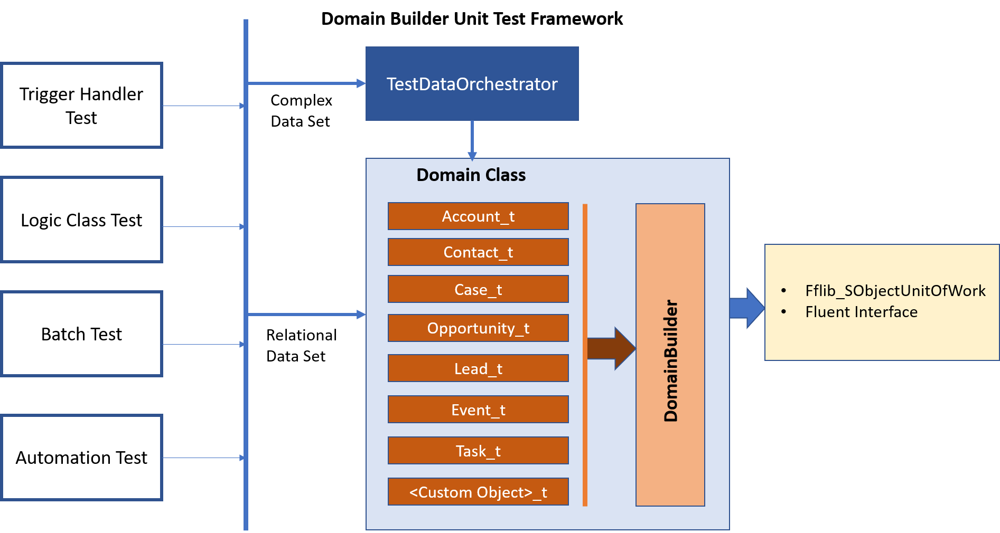

# Domain Builder Unit Test Framework
#### Extended on top of Domain Builder Framework by [Robert Sösemann](https://github.com/rsoesemann/apex-domainbuilder)

Test Data Builder framework to setup test data for complex Apex integration tests in a concise, readable and flexible way. 


<a href="https://githubsfdeploy.herokuapp.com?owner=tirtha83&repo=DomainBuilderUnitTestFramework">
  
</a>

Setting up test data for complex Apex integration tests is not easy, because you need to..:

 - set required fields even if irrelevant for the test 
 - insert the objects in the right order
 - create relationships by setting Lookup fields
 - put ugly `__c` all over the place
 - clutter your code with `Map<Id, SObject>` to keep track of related records
 - reduce the DML statements to not hit Governor Limits
 
TestFactories as used by many developers and recommended by Salesforce.com can help to minimize ugly setup code by moving it to seperate classes. But over the time those classes tend to accumulate complexity and redundant spaghetti code.

In the world of Enterprise software outside of Salesforce.com there are experts that have created patterns for flexible and readable (fluent, concise) test data generation. Among them the most notable is Nat Pryce who wrote a great book about testing and somewhat invented the [Test Data Builder](http://www.natpryce.com/articles/000714.html) pattern.

**Domain Builder Unit test Framework** use Domain Builder for each entity. It also provides TestOrchestrator for complex test data set generation. 



1. By incorporating a simple small Builder class for each test-relevant Domain SObject we centralize all the creation knowledge and eliminating redundancy.

```java
@IsTest
public class Account_t extends DomainBuilder {

	public Account_t() {
		super(Account.SObjectType);

		name('Acme Corp');
	}

	public Account_t name(String value) {
		return (Account_t) set(Account.Name, value);
	}

	public Account_t add(Opportunity_t opp) {
		return (Account_t) opp.setParent(Opportunity.AccountId, this);
	}

	public Account_t add(Contact_t con) {
		return (Account_t) con.setParent(Contact.AccountId, this);
	}
}
```
For Ready Reference, Domain Builder Test Classes are already being added in this repo for following Sales, Service Cloud standard object :

    1. Account
    2. Contact
    3. Opportunity
    4. Case
    4. Event
    5. Task
    6. Lead AND
    7. User

2. By internally leveraging the [`fflib_SObjectUnitOfWork`](https://github.com/financialforcedev/fflib-apex-common/blob/master/fflib/src/classes/fflib_SObjectUnitOfWork.cls) for the DML all test run dramatically faster.
3. The [Fluent Interface](https://en.wikipedia.org/wiki/Fluent_interface) style of the Builder pattern combined with having all the database wiring encapsulated in the Unit of work made each test much more understandable.
```java
    @IsTest
    private static void easyTestDataCreation() {

        // Setup
        Contact_t jack = new Contact_t().first('Jack').last('Harris');

        new Account_t()
                .name('Acme Corp')
                .add( new Opportunity_t()
                                .amount(1000)
                                .closes(2019, 12)
                                .contact(jack))
                .persist();
        
        // Exercise
        ...
	
	
	// Verify
	...
    }
```
4. Using Graph algorithms to autodetect the correct insert order in the Unit Of Work.
5. **TestDataOrchestrator** class makes it easier to build test data for complex test scenarios.
```java
TestDataOrchestrator.DefaultDataSet defaultData = new TestDataOrchestrator().createDefaultDataSet();
```
6. With use of inbuild method, test data can be created in bulk with different attributes.

```java

List<Account_t> accounts = new List<Account_t>();
for (Integer i = 0; i < 10; i++) {
    Account_t acc = new Account_t().name('Test ' + i);
    accounts.add(acc);
}
List<SObject> objectRecords = new TestDataOrchestrator().persistAll(accounts);

```

### Simple Domain Builder Method and Entity class creation Snippet

For Simplicity, copy-paste following two snippets for creating Domain builder classes and methods within minute.

* For Creating Test Method -
```java

"Test Data Method create": {
	 	"prefix": "testbuilderMethod",
	 	"body": [
	 		"public ${1:Object}_t ${2:field}(string value){",
			"\treturn (${1:Object}_t) set(${1:Object}.${3:fieldAPI}, value);",
			"}",
	 		"$4"
	 	],
		"description": "Create Test Builder Quick Method"
	},
```
* For Creating Domain Class -
```java
	"Doamin class Create": {
		"prefix": "testDomainEntityCreate",
		"body": [
			"@IsTest",
			"public class ${1:Entity}_t extends DomainBuilder {",
			
				"\n\tpublic ${1:Entity}_t() {",
					"\t\tsuper(${1:Entity}.SObjectType);",
					"\t\t// Populate Required Fields HERE",
					"\t\tname('Test ${1:Entity}');",
				"\t}",
				"\n\t /* -- For auto relation builder",
				"\tpublic ${1:Entity}_t(RelationshipEntity a) {",
					"\t\tsuper(${1:Entity}.SObjectType);",
					"\t\tsetParent(${1:Entity}.RelationId, a);",
				"\t}",
				"\t*/",
				"\n\t // Test Method HERE, Use Snippet - testbuilderMethod",
				"\tpublic ${1:Entity}_t name(String value) {",
					"\t\treturn (${1:Entity}_t) set(${1:Entity}.Name, value);",
				"\t}",
			"}",	
			"$2"
		],
	   "description": "Create Test Builder Entity"
   }
   ```
   To add the above snippets, navigate under **File > Preferences > User snippets** and paste above at apex.json file.